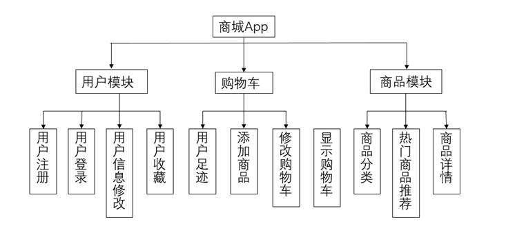
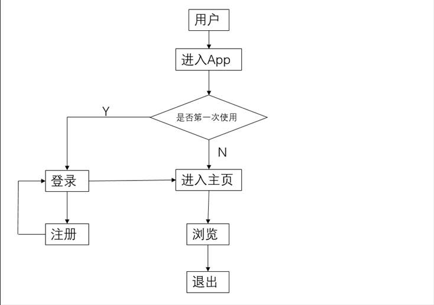

# EMarket

## 一、简介

基于Android的一个电子商城。服务器端使用Ubuntu16+Apache+PHP+MySQL5.7搭建。商品数据是用python爬虫爬取京东、唯品会的少量商品（约10k）的部分信息（商品名，商品价格，商品图片）。

**注：由于云服务器租用时间到期，后台接口已经失效。**

## 二、系统设计


​           

​            

## 三、数据库设计

### 	1、SQLite

本系统共涉及到5个表，主要几个表是用户信息表user、收藏表collection、足迹表record、购物车信息表cart、登录信息表login_info。具体表结构的设计如下：

1. 用户信息表：

   **表4-1 用户信息表（user）**

| 字段名      | 数据类型       | 可否为空 | 含义           |
| ----------- | -------------- | -------- | -------------- |
| **account** | Varchar(20)    | N        | 标识，用户账号 |
| name        | varchar（10）  | Y        | 用户名         |
| password    | varchar（10）  | Y        | 密码           |
| headimg     | varchar  (20)  | Y        | 用户头像路径   |
| Address     | varchar（200） | Y        | 用户住址       |

​	2.收藏表：

​		**表4-2 收藏表（collection）**

| 字段名      | 数据类型       | 可否为空 | 含义         |
| ----------- | -------------- | -------- | ------------ |
| **Account** | Varchar (20)   | N        | 用户名       |
| C_name      | varchar（100） | Y        | 商品名称     |
| C_src       | varchar（100） | Y        | 商品图片路径 |
| C_price     | Double         | Y        | 商品价格     |

 

3. 足迹表：

   **表4-3 足迹表（record）**

| 字段名      | 数据类型       | 可否为空 | 含义         |
| ----------- | -------------- | -------- | ------------ |
| **Account** | Varchar (20)   | N        | 用户名       |
| C_name      | varchar（100） | Y        | 商品名称     |
| C_src       | varchar（100） | Y        | 商品图片路径 |
| C_price     | Double         | Y        | 商品价格     |

4. 购物车表：

   **表4-4 购物车信息表（cart）**

| 字段名      | 数据类型       | 可否为空 | 含义         |
| ----------- | -------------- | -------- | ------------ |
| **Account** | Varchar (20)   | N        | 用户名       |
| C_name      | varchar（100） | Y        | 商品名称     |
| C_src       | varchar（100） | Y        | 商品图片路径 |
| C_price     | Double         | Y        | 商品价格     |
| C_quantity  | Int            | Y        | 商品数量     |

5. 登录信息表：

​	**表4-5 登录信息表（login_info）**

| 字段名      | 数据类型     | 可否为空 | 含义     |
| ----------- | ------------ | -------- | -------- |
| **account** | Varchar (20) | N        | 用户账号 |

## 四、效果展示

​                      


​                 

​                      

​                      

## 五、备注

### 0.最终解决参与bug

​	（1）足迹未空时点击闪退
​		solve：增加足迹 的判断
​	（2）未登录时，购物车闪退、我的 闪退，点击商品闪退
​		solve：增加每个activity、fragment的用户null判断；
​			未空时增加跳转到登录；同时增加onResume回调函数判断用户，null是重新读取用户
​	（3）fragment隐藏后，在显示的fragment依旧能够触发上一个已隐藏的fragment的事件触发（因为之前使用hide方法）
​		solve：
​		注：好像是fragment的bug？就和有时fragment隐藏不完全
​	（4）导出apk 密码错误
​		solve：clean project、删除build文件夹

### 1.圆形头像：

第三方开源控件RoundedImageView
https://github.com/vinc3m1/RoundedImageView
https://www.jianshu.com/p/e45f3bdb8da8

### 2.分界线组件

​        <View
​            android:layout_width="match_parent"
​            android:layout_height="1dp"
​            android:background="#BEBBBB"/>

### 3.资源

​	http://jsonplaceholder.typicode.com/

### 4、搜索框：

​	https://blog.csdn.net/qq_34650238/article/details/79378475
​		

		<include layout="@layout/banner"
	    android:layout_width="match_parent"
	    android:layout_height="0dp"
	    android:layout_weight="1"></include>
### 5.Banner：

​	https://blog.csdn.net/wangwangli6/article/details/77523095（没用）
​	https://github.com/pinguo-zhouwei/MZBannerView（不好用，而且出现bug）
​	https://github.com/youth5201314/banner（没用）
​	Fragment就是一个特殊的activity，所以代码需写在Fragment里
​		

### 6.一个商城

​	https://github.com/yuanbao15/MobileShop （备注：没用）

### 7.ListView的子控件监听事件

​	https://blog.csdn.net/Leslie___Cheung/article/details/79733557（这个很复杂）
​	其实书上也有

### 8.AS自动导包

​	alt+enter

### 9.SQLite数据库

​	（1）使用方法，书上有。值得注意的是onCreate方法里里面创建数据表只会在第一次创建时创建。
​	（2）操作SQLite数据库：
​		①在AS终端输入adb shell，把文件挂载到Linux空间
​		②然后就开启了Linux的操作 cd data/data/com.example.e_market[你的apk包命]/databases
​		③进入到数据库文件夹下，sqlite3 [你的数据库名]
​		④开始你的数据库操作，不过与SQL稍有不同，查看数据表用.table，查询方法一样，其他未知
​		

### 10.JSON数据解析

​	（1）http://www.bejson.com/java2pojo/可以输入json直接转化为JavaBean，很方便。
​	（2）google提供得Gson包解析json数据

### 11.Ubuntu上装的php没有mysqli模块

​	php -m查看已安装模块
​	sudo apt install php7.0-mysql安装pdo mysqli等相关模块
​	sudo service apache2 restart重启服务器
​	python文件在Linux下一定要加上# -*- coding: utf-8 -*-

### 12.vim编辑器

​	直接输入/你要查找的字符  即可查找

### 13.mysql字符

​	查看字符集show variables like 'character_set%';
​	修改set character_set_client=utf8;
​	

```shell
查看数据库字符集show create database jd_commodities
修改alter database jd_commodities default character set utf8
修改服务器默认python版本：https://www.cnblogs.com/justcoder/p/10400482.html
安装lxml真是一件困难事https://blog.51cto.com/zhaopeiyan/2062016
```

### 14.乱码无效问题

​	$pdo->query("set names utf8");//少了这关键的一句
​	$db->query("set names utf8");
​	URL需要编码，空格之类的特殊字符需要编码
​	如空格是%20，但是使用Uri.encode()会把一些必要的也替换掉，比如/ ：
​	最后使用replace（）方法替换空格，得以解决